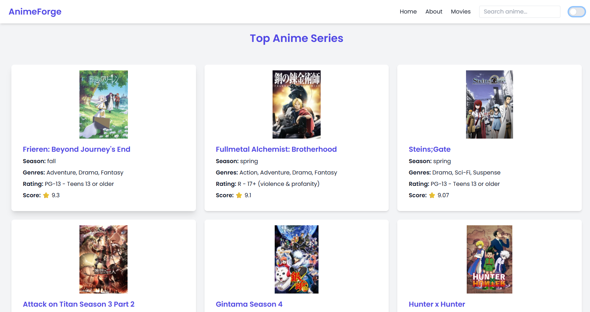
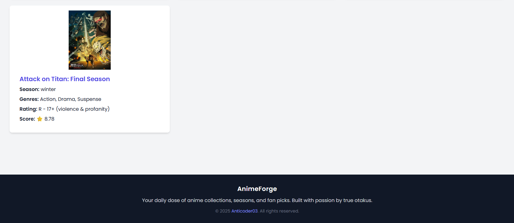
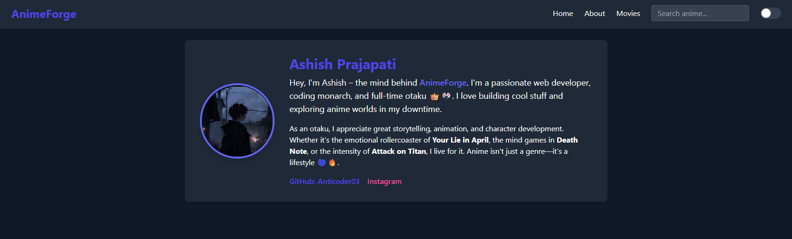
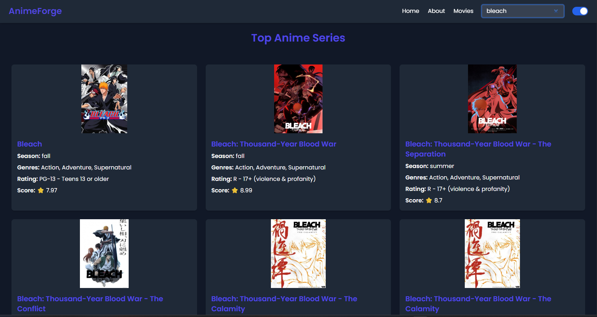
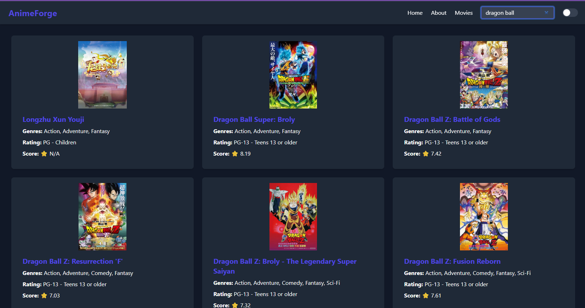

# AnimeForge 🎌🔥

Welcome to **AnimeForge** – a sleek, responsive, anime-centered web app built for otakus, by an otaku. This app fetches data from the [Jikan API](https://jikan.moe/) (MyAnimeList Unofficial API) and beautifully displays top anime series and movies with complete dark/light theme support, search features, and dynamic pages.

---

## 🌟 Features

- 🎥 View **Top Anime Series** and **Movies**
- 🔍 Search any anime using keywords
- 💡 Toggle between **Dark/Light Theme**
- 📱 Fully Responsive UI
- 🧠 Clickable anime cards open a **detailed info page**
- 👨‍💻 Built with **HTML, Tailwind CSS, JavaScript**
- 🧩 Powered by [Jikan API](https://jikan.moe/)

---

## 🔧 Tech Stack

- **Frontend:** HTML5, Tailwind CSS
- **JavaScript:** Vanilla JS (No Frameworks)
- **API:** [Jikan API](https://jikan.moe/)

---

## 📸 Preview

## 🖼️ Screenshots








---

## 📂 Project Structure

```

AnimeForge/
├── index.html             # Home page (Top Anime)
├── movies.html            # Movie listing
├── anime.html             # Anime details page
├── about.html             # About the creator
├── search.js              # Handles search
├── theme\_change.js        # Theme toggle logic
├── styles/                # Tailwind utility (if extended)
└── README.md & LICENSE    # Docs

```

---

## 🔗 Live Demo

🚀 _Coming Soon on Netlify_  
_Or host it yourself! Just open `index.html` in your browser._

---

## 🙋‍♂️ About Me

I’m **Ashish Prajapati**, a full-blooded coder + anime fan (call me a Coding Senpai). I built this project to combine my two loves — tech & anime.

- 📸 [Instagram](https://www.instagram.com/ashiah03_prajapati/)
- 💻 [GitHub](https://github.com/Anticoder03)

